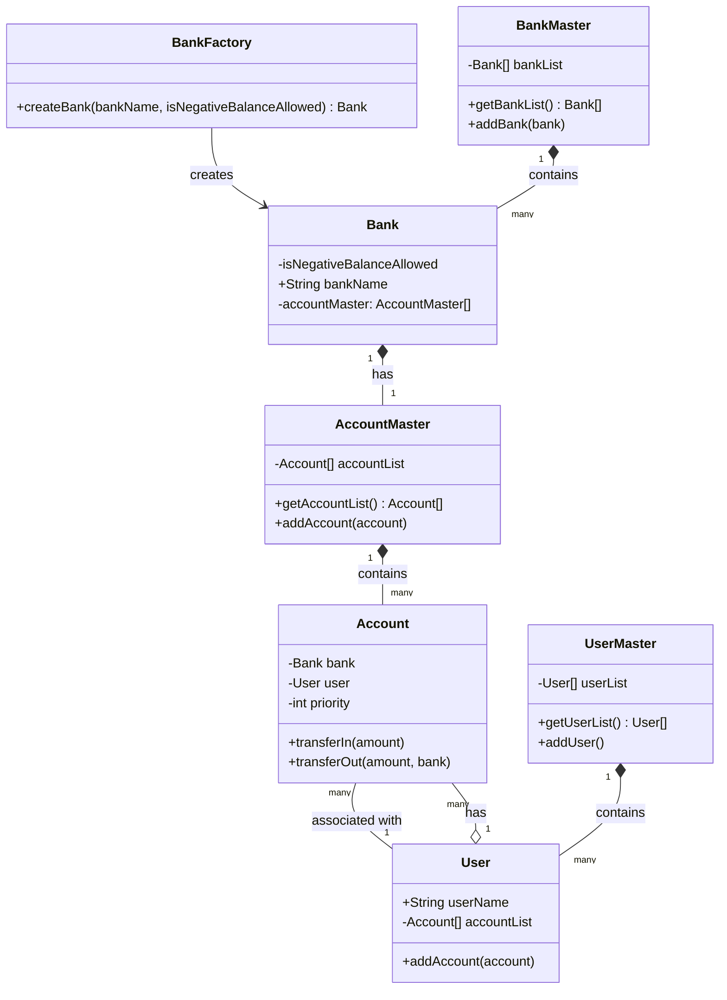

```mermaid
classDiagram
    BankFactory --> Bank : creates
    BankMaster "1" *-- "many" Bank : contains
    Bank "1" *-- "1" AccountMaster : has
    AccountMaster "1" *-- "many" Account : contains
    Account "many" -- "1" User : associated with
    UserMaster "1" *-- "many" User : contains
    User "1" o-- "many" Account : has

    class BankFactory {
        +createBank(bankName, isNegativeBalanceAllowed) Bank
    }
    class BankMaster {
        -Bank[] bankList 
        +getBankList() Bank[]
        +addBank(bank)
    }
    class Bank {
        -isNegativeBalanceAllowed
        +String bankName
        -accountMaster: AccountMaster[]
    }
    class AccountMaster {
        -Account[] accountList
        +getAccountList() Account[]
        +addAccount(account)
    }
    class Account {
        -Bank bank
        -User user 
        -int priority
        +transferIn(amount)
        +transferOut(amount, bank)
    }
    class UserMaster {
        -User[] userList 
        +getUserList() User[] 
        +addUser()
    }
    class User {
        +String userName
        -Account[] accountList
        +addAccount(account)
    }
```